# JS-Decompiler: JavaScript Decompilation Pipeline

**Note**: This is an experimental tool for analyzing minified JavaScript files, such as `input/cli.js`, for educational purposes only. Ensure you have permission to analyze the input file. ⚠️

## 🚀 Purpose

This script deconstructs a minified JavaScript file into modular components, creating a pseudo-sourcemap, dependency graph, and AI-generated analysis. It processes the input through a pipeline:

1. **Prettier**: Formats code for readability.
2. **Webcrack**: Deobfuscates variable names.
3. **Tree-sitter**: Splits code into modular files (functions, classes, etc.).
4. **Vertex AI**: Generates descriptions for each file using Google Vertex AI (via LangChain.js).

The goal is to reverse-engineer minified JavaScript, making it easier to understand its structure and functionality.

## 🎯 Why

To learn how to break down a minified JavaScript file into manageable parts, approximate a source map, and leverage AI to analyze code, enhancing reverse-engineering skills.

## 📋 Prerequisites

- **Node.js** v22.15.0 or later (`node --version` to check).
- **Google Vertex AI** service account JSON key, placed in `config/vertex_ai_service_account.json`.
- **Git** (optional, for version control).

## 🛠️ Installation

1. Clone this repository or copy the project files.
2. Navigate to the project root:
   ```bash
   cd project-root
   ```
3. Initialize a Node.js project (if not already done):
   ```bash
   npm init -y
   ```
4. Install dependencies using `package.json`:
   ```bash
   npm install
   ```
   This installs `prettier`, `webcrack`, `tree-sitter`, `@langchain/google-vertexai`, `dotenv`, `yargs`, and `eslint`.
5. Place your Vertex AI service account JSON key in `config/vertex_ai_service_account.json`.
6. Create a `config/.env` file:
   ```env
   VERTEX_AI_CREDENTIALS_PATH=config/vertex_ai_service_account.json
   ```
7. Ensure `.gitignore` includes `config/vertex_ai_service_account.json`, `.env`, `node_modules/`, and `output/` to protect sensitive data.

## 📂 Project Structure

```
project-root/
├── src/                          # Source code
│   ├── deconstruct_pipeline.js   # Main script
│   └── utils/                   # Utility modules (optional)
├── config/                      # Configuration files
│   ├── .env                     # Environment variables
│   └── vertex_ai_service_account.json # Vertex AI credentials
├── input/                       # Input files
│   └── cli.js                   # Example minified JS
├── output/                      # Output directory
│   └── deconstructed_output/    # Generated files
├── tests/                       # Test files
│   └── deconstruct_pipeline.test.js # Placeholder
├── .gitignore                   # Git ignore file
├── package.json                 # Dependencies and scripts
├── README.md                    # This file
└── .eslintrc.json               # ESLint configuration
```

## 🖥️ Usage

Run the script with a minified JavaScript file:

```bash
node src/deconstruct_pipeline.js <input_file> [--output-dir <path>]
```

**Example**:

```bash
node src/deconstruct_pipeline.js input/cli.js --output-dir output/custom
```

**Help**:

```bash
node src/deconstruct_pipeline.js --help
```

Alternatively, use the npm script:

```bash
npm start input/cli.js --output-dir output/custom
```

## 📥 Expected Input

Minified JavaScript files with:
- Short variable names (e.g., `zZ6`, `QZ6`, `J1`, `A`).
- No whitespace or comments.
- Compressed syntax (e.g., `import{createRequire as zZ6}from"node:module";var QZ6=Object.create;...`).

Place input files in `input/` (e.g., `input/cli.js`).

## 📤 Output Structure

The script creates a directory (default: `output/deconstructed_output/`) with:

- `1_minified_prettier.js`: Formatted code.
- `2_minified_webcrack.js`: Deobfuscated code.
- `3_minified_tree_sitter/`: Modular files in subdirectories:
  - `functions/`: Function declarations/methods.
  - `classes/`: Class declarations.
  - `imports/`: Import statements.
  - `exports/`: Export statements.
  - `variables/`: Variable declarations.
  - `constants/`: Const/let declarations.
  - `base/`: Miscellaneous code.
- `sourcemap.json`: Maps files to original line numbers.
- `dependency_graph.json`: File relationships.
- `llm_analysis.md`: AI-generated descriptions for each file.
- `README.md`: Output-specific documentation.

**Example**:

```
output/deconstructed_output/
├── 1_minified_prettier.js
├── 2_minified_webcrack.js
├── 3_minified_tree_sitter/
│   ├── functions/
│   │   ├── module_helper.js
│   │   ├── another_function.js
│   ├── imports/
│   │   ├── import_createRequire.js
│   ├── base/
│   │   ├── base.js
├── sourcemap.json
├── dependency_graph.json
├── llm_analysis.md
├── README.md
```

## 🔄 Pipeline Workflow

The following Mermaid chart illustrates the pipeline’s top-down workflow, showing how a minified JavaScript file is processed through each step to produce the output.

```mermaid
graph TD
    A[📄 Input File<br>input/cli.js] -->|Minified JS| B[🖌️ Prettier]
    B -->|Formatted Code| C[🔍 Webcrack]
    C -->|Deobfuscated Code| D[🌳 Tree-sitter]
    D -->|Modular Files| E[🤖 Vertex AI]
    E -->|Descriptions| F[📂 Output<br>output/deconstructed_output/]
    
    classDef pipeline fill:#4B8BBE,stroke:#333,stroke-width:2px,color:#FFF;
    class A,B,C,D,E,F pipeline;
```



**Pipeline Steps**:
1. **🖌️ Prettier**: Formats minified code for readability, saving to `1_minified_prettier.js`.
2. **🔍 Webcrack**: Deobfuscates variable names, saving to `2_minified_webcrack.js`.
3. **🌳 Tree-sitter**: Parses code into modular files (e.g., functions, classes), saving to `3_minified_tree_sitter/`.
4. **🤖 Vertex AI**: Analyzes each file with Google Vertex AI, generating descriptions in `llm_analysis.md`.
5. **📂 Output**: Includes sourcemap (`sourcemap.json`), dependency graph (`dependency_graph.json`), and a README.

## 📝 Notes

- **Vertex AI Setup**: Obtain a service account JSON key from Google Cloud (see https://cloud.google.com/vertex-ai/docs). Ensure it has `roles/aiplatform.user` permissions.
- **Performance**: Monitor memory usage for large files during Tree-sitter parsing.
- **Security**: Never commit `config/vertex_ai_service_account.json` or `.env`. Verify `.gitignore`.
- **Extensibility**: Add utility functions to `src/utils/` or tests to `tests/` as needed.
- **Linting**: Use ESLint (`npx eslint src/`) for code quality, configured in `.eslintrc.json`.

## 🐞 Troubleshooting

- **Module not found**:
  - Run `npm install` to install dependencies.
  - Verify `package.json` is in the root.
- **Invalid credentials**:
  - Check `config/.env` points to `config/vertex_ai_service_account.json`.
  - Ensure the JSON key is valid.
- **Output path errors**:
  - Use `--output-dir` to specify a valid path (e.g., `output/custom`).
- **Slow LLM calls**:
  - The script includes retry logic for Vertex AI rate limits. Check your quota at https://console.cloud.google.com.

## 🌐 References

- Prettier: https://prettier.io/docs/en/
- Webcrack: https://github.com/j4k0xb/webcrack
- Tree-sitter: https://tree-sitter.github.io/
- LangChain.js (Vertex AI): https://js.langchain.com/docs/integrations/chat/google_vertex_ai
- Yargs: https://yargs.js.org/
- Google Vertex AI: https://cloud.google.com/vertex-ai/docs
- Node.js: https://nodejs.org/